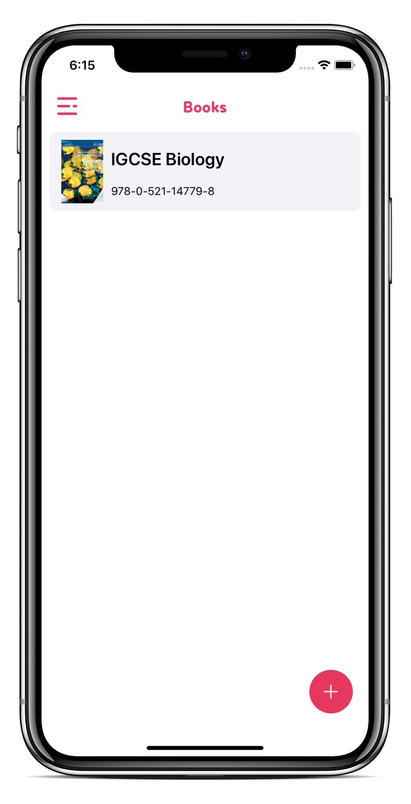
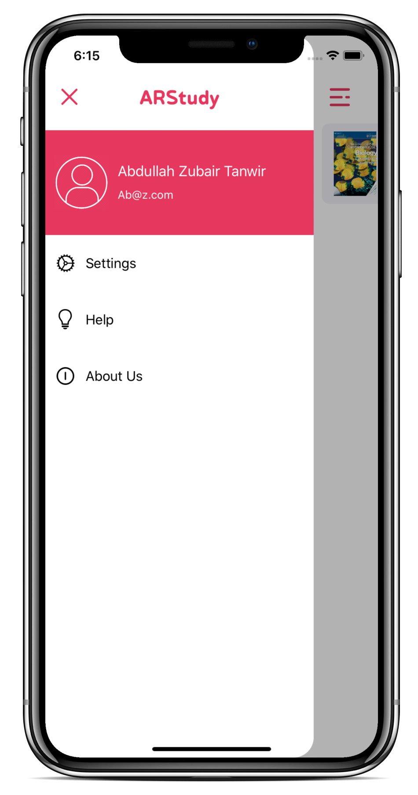
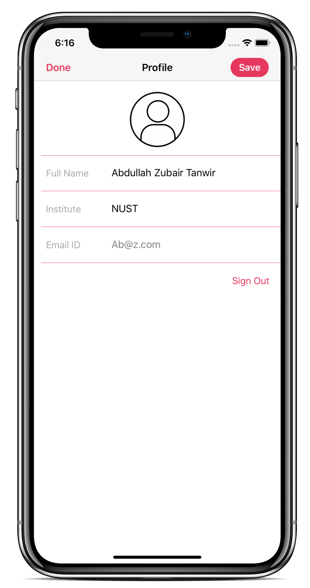
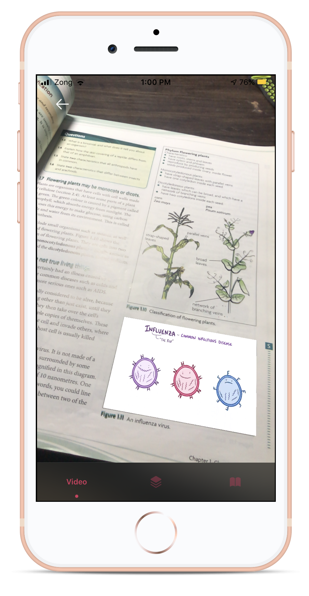
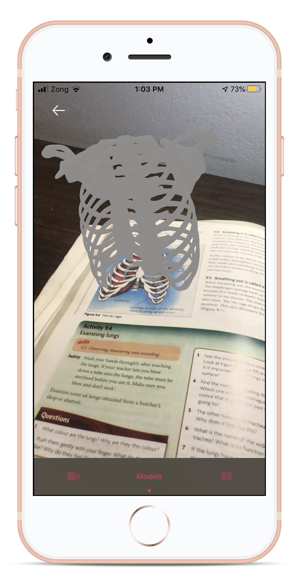
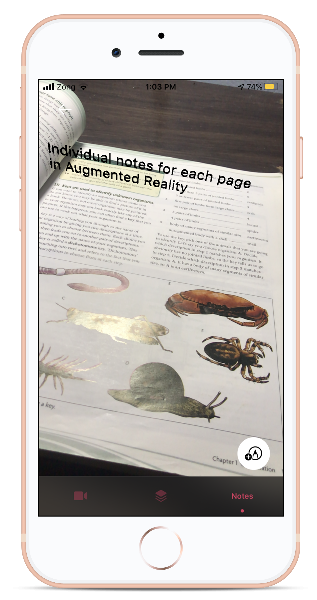

# ARStudy

An app through which you can interact with your books, by rendering your notes, videos and diagrams in Augmented Reality. Notes are saved locally and on your account, and can be viewed through online portal.

### Technologies Used: ###
* Swift 5
* Firebase
* ARKit 
* Realm

&nbsp;&nbsp;&nbsp;&nbsp;&nbsp;&nbsp;&nbsp;&nbsp;&nbsp;&nbsp;&nbsp;&nbsp;&nbsp;&nbsp;

&nbsp;&nbsp;&nbsp;&nbsp;&nbsp;&nbsp;&nbsp;&nbsp;&nbsp;&nbsp;&nbsp;&nbsp;&nbsp;&nbsp;

